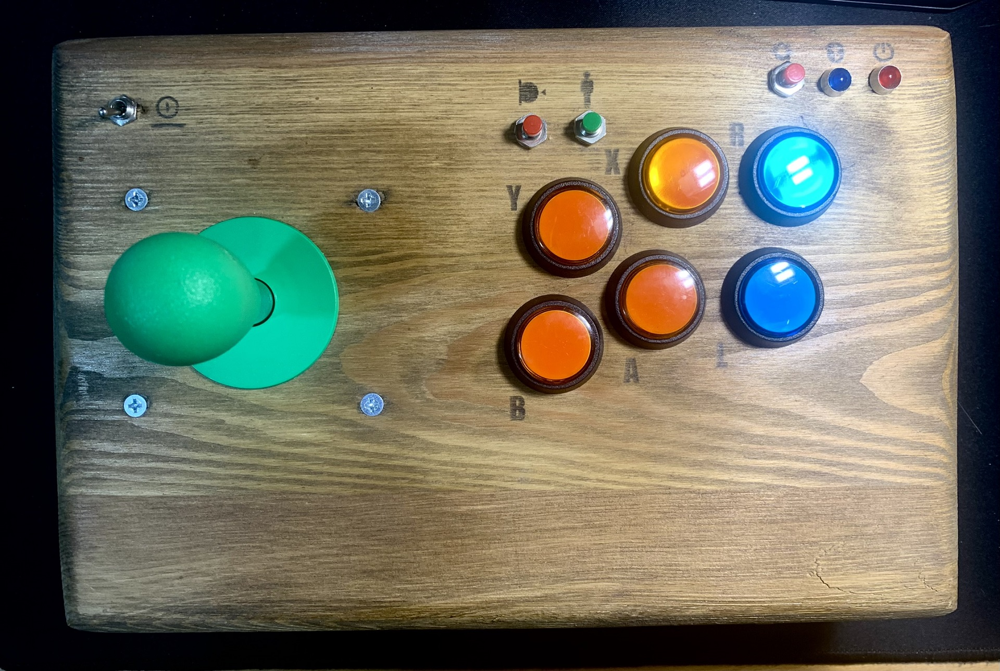

# ESP32 Arcade

Full wireless arcade joystick implementation with support for button leds and programable
autofire with rate adjustment.





## Buttons

It has 6 buttons plus Start and Select (1P and COIN for MAME). Everyone of the 6 main buttons
supports an attached led. All the 6+2 buttons and the six leds are attached to ESP32 GPIO pins
(take a look at [```src/gamepad_input.h```](src/gamepad_input.h) for the pin mappings). Any one of the 6 main buttons
supports autofire with adjustable rate.
There is another 'menu' button which is used to enter the autofire programming mode. This 'menu'
button can also be used as an 'alt' key which produces 'logical buttons'. For example, pushing
'menu' and 'button 1' simultaneously simulates 'button 9'. Those extra buttons can be useful
for the MAME menu options (pause, config menu, etc).

If you need a full 8 buttons joystick, you could connect the current Start and Select to a
good pushbutton and, on the computer, map the Start and Select to some of the above mentioned
'logical buttons'.

And if you need more phisical buttons, you can always connect them to an ESP32 GPIO and change the
code on [```src/gamepad_input.cpp```](src/gamepad_input.cpp)) accordingly.

Here is a simple video showing the buttons:

[](https://youtu.be/9QGxNvs3dx0)

## MAME

On folder ```configs/mame/ctrlr``` is a ```ctrlr``` file with convenience
button mappings for **MAME**.

## Retro computers

If want to use this Bluetooth LE controller (or another Bluetooth LE controller) on a retro computer
or console, you can take a look on the [BLERetro32](https://github.com/Peluko/BLERetro32) project.
